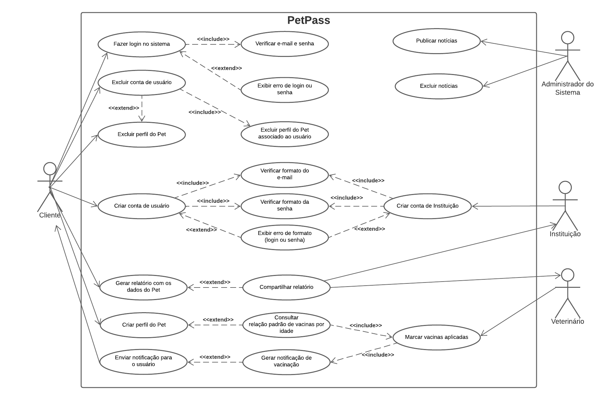
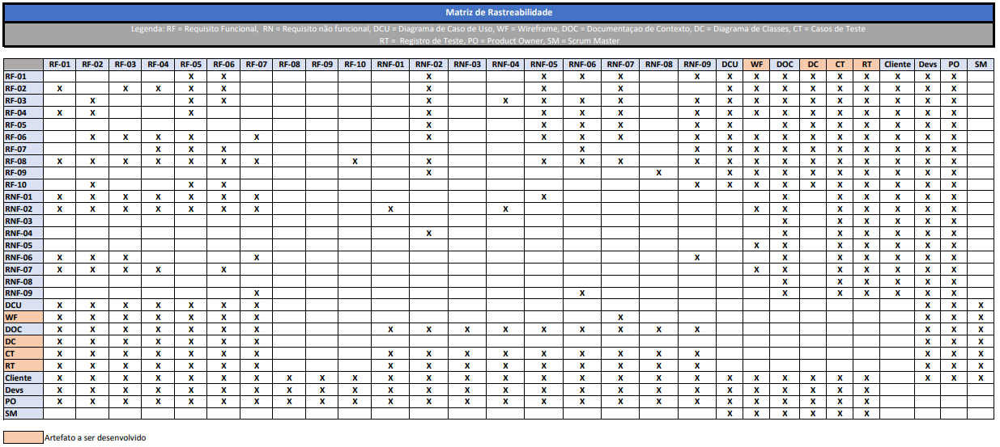
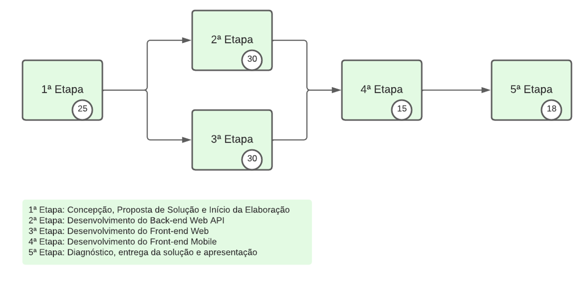
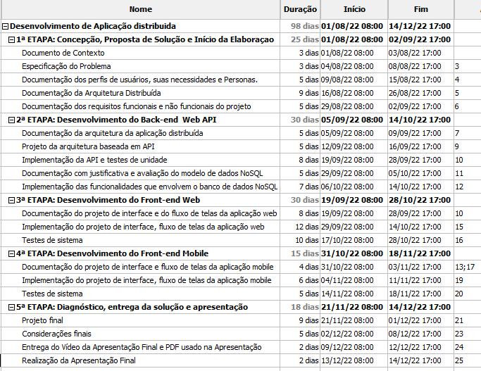
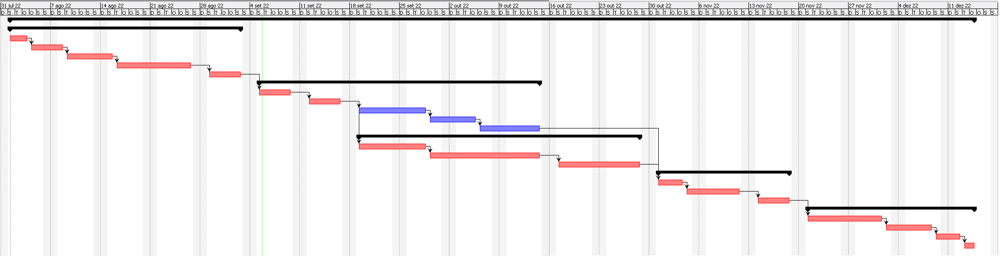
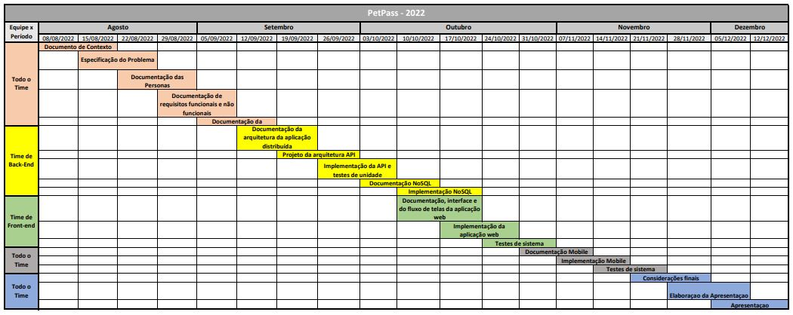
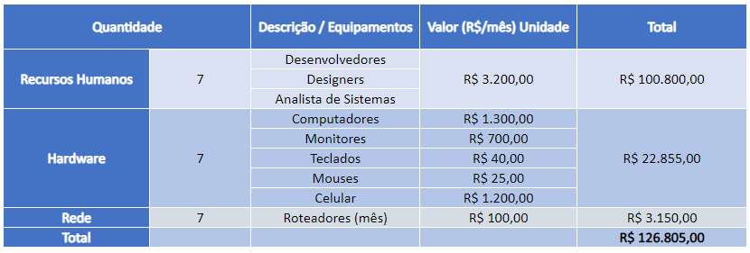

# Especificações do Projeto

Pré-requisitos: <a href="1-Documentação de Contexto.md"> Documentação de Contexto</a>

A definição do problema e os pontos mais relevantes a serem tratados no escopo deste projeto foram consolidados na forma de personas e histórias de usuários, para melhor entendimento das necessidades do cliente e de seu público alvo.

## Personas

As personas levantadas durante o processo de entendimento do problema são apresentadas abaixo.

### Priscila Amaral

- **Idade:** 32 anos
- **Ocupação:** Dona de um abrigo de animais
- **Motivação:** Encontrar um lar para animais abandonados.
- **História:** Desde pequena, Priscila sempre teve animais de estimação. Daí veio sua inspiração para se tornar uma médica veterinária pois, diante do seu amor pelos bichinhos, passou a dedicar sua vida a cuidar deles. Fundou um abrigo para acolher animais abandonados, ou em situação de rua, e incentiva a adoção dos mesmos.
- **Necessidade:** Um de seus desejos é ter um meio mais prático para registrar as informações importantes sobre a vacinação dos animais que se encontram em seu abrigo, já que são muitos.

### Elena Lima

- **Idade:** 40 anos
- **Ocupação:** Advogada e Empresária
- **Motivação:** Com seu hotelzinho de animais, visa prestar o melhor serviço a eles e garantir a satisfação dos donos.
- **História:** Após se formar como advogada, Elena resolveu investir em um setor que está em crescimento, o de hotel de animais. Desde sempre amou seus diversos pets e quis conciliar essa característica com a vontade de crescer financeiramente.
- **Necessidade:** Conhecer os registros de vacinas dos animais antes de hospedá-los em seu hotel.

### Fernanda Amorim

- **Idade:** 33 anos
- **Ocupação:** Analista Contábil em uma empresa multinacional
- **Motivação:** Cuidar bem dos seus pets para proporcionar a eles uma boa qualidade de vida.
- **História:** Desde a infância Sempre gostou da companhia de animais e agora resolveu adotar um cachorro e um gato de rua.
- **Necessidade:** Gostaria de ter um local onde possa armazenar as informações referente as vacinas que já foram aplicadas em cada um dos seus pets (nome da vacina, data de aplicação, etc.).

### Carlos Silva

- **Idade:** 70 anos
- **Ocupação:** Professor aposentado
- **Motivação:** Ter um modo mais fácil de registrar os dados de vacinação de seu cachorro e de seu gato.
- **História:** Desde pequeno Carlos teve animais diversos. Quando se aposentou, aos 65 anos, resolveu adotar um gato e um cachorro para sua companhia. Hoje em dia vive com esses animais e tem a intenção de mantê-los saudáveis e com cronogramas vacinais em dia.
- **Necessidade:** Como sempre perde os cartões de vacinação de seus animais, Carlos deseja um local onde possa guardar e acessar os dados vacinais de seus animais de maneira fácil, prática e intuitiva.

### Jorge Lima

- **Idade:** 32 anos
- **Ocupação:** Assistente de clínica veterinária
- **Motivação:** Ter um ambiente digital para registrar os dados dos pacientes e seus cadastros de vacinação e medicamentos.
- **História:** Desde pequeno Jorge conviveu com os animais, pois seu pai é dono de uma clínica veterinária. Atualmente, Jorge é estudante de medicina veterinária e trabalha como assistente de seu pai na clínica de sua família.
- **Necessidade:** Jorge está trabalhando para modernizar os processos burocráticos da clínica e viu a oportunidade de digitalizar o primeiro cadastro dos pacientes. Dessa forma os dados dos animais estariam disponíveis também na forma digital, bem como seu cronograma de vacinação.

## Histórias de Usuários

A partir da compreensão do cotidiano das personas identificadas para o projeto, foram registradas as seguintes histórias de usuários:

| EU COMO... `PERSONA` | QUERO/PRECISO ... `FUNCIONALIDADE`                                                                           | PARA ... `MOTIVO/VALOR`                                                                                                                                                               |
| -------------------- | ------------------------------------------------------------------------------------------------------------ | ------------------------------------------------------------------------------------------------------------------------------------------------------------------------------------- |
| Priscila Amaral      | registrar informações básicas dos animais (dados)                                                            | facilitar o controle para adoção.                                                                                                                                                     |
| Priscila Amaral      | controlar de forma mais prática a vacinação                                                                  | manter atualizadas as vacinas que já foram dadas.                                                                                                                                     |
| Elena Lima           | consultar os dados de vacinação dos animais                                                                  | aceitar hospedá-los no meu hotel com maior segurança.                                                                                                                                 |
| Fernanda Amorim      | encontrar uma solução para programar as datas de aplicação das vacinas dos meus pets                         | não pôr em risco a saúde dos meus animais.                                                                                                                                            |
| Fernanda Amorim      | encontrar uma solução digital que me permita ter o controle de quais vacinas já foram aplicados em meus pets | não precisar depender apenas da carteira física de vacinação.                                                                                                                         |
| Carlos Silva         | encontrar uma aplicação onde seja fácil registrar informações básicas de vacinação dos animais               | tornar mais fácil o controle das vacinas, pois tenho dificuldade em lembrar onde guardei os cartões de vacinação e também não tenho muita familiaridade em acessar _sites_ complexos. |
| Jorge Lima           | encontrar uma aplicação onde eu possa fazer o registro dos animais (pacientes) que vêm à minha clínica       | tornar mais fácil o controle das vacinas, mantendo também no formato digital os registros dos pacientes.

## Modelagem do Processo de Negócio 

A modelagem do processo de negócio foi feita utilizando-se a notação BPMN (*Business Process Model Notation*), gerando um fluxograma para cada situalção.

### Análise da Situação Atual

Atualmente, o procedimento de registro oficial de um pet exige que o tutor leve o animal ao veterinário para que este o examine, dê as primeiras vacinas e prepare sua carteira de vacinação física. Esse processo é feito totalmente de forma manual, sendo o tutor do pet a pessoa responsável por guardar o cartão físico de vacinação durante toda a vida de seu melhor amigo, sempre carregando-o consigo nas consultas ao veterinário e em eventuais viagens com seu pet.

O fluxograma abaixo ilustra este processo:

### Descrição Geral da Proposta

A proposta do Pet Pass é tornar parte do processo de registro e acompanhamento do esquema vacinal dos pets mais automatizada, flexível e de fácil acesso. Com o Pet Pass, o proprio tutor do pet poderá fazer seu registro assim que adotar seu melhor amigo, levando, posteriormente, para o veterinário conferir as informações e adicionar os dados de vacinação. Todas as informações do pet poderão ficar armazenadas no aplicativo e relatórios atualizados poderão ser emitidos para o acampanhamento do veterinário, ou apresentação em aeroportos, hotéis, etc. Além disso o sistema também dará lembretes ao usuário sobre as datas das próximas vacinas.

O fluxograma abaixo ilustra o novo processo, utilizando o PetPass como ferramenta:

Para entender melhor o funcionamento interno dos processos que ocorrem dentro do aplicativo do Pet Pass, foi elaborado um fluxograma de processo da aplicação.

## Indicadores de Desempenho

Seguem abaixo a relação dos indicadores de desempenho desenvolvidos para o projeto:

| Nº | Indicador | Objetivo | Descrição | Cálculo | Fonte de Dados | Perspectiva | Meta | Periodicidade |
|----|-----------|----------|-----------|---------|----------------|-------------|------|---------------|
|	1	|	Índice de avalição dos usuários	|	Verificar a aceitação do aplicativo móvel	|	Número de estrelas	|	Medir a média das avaliações (notas) dadas pelos usuários que baixaram e utilizaram o app	|	Play Store e Apple Store	|	Qualidade do produto	|	Avaliação acima de 4 estrelas	|	Trimestral	|
|	2	|	Taxa de download do aplicativo	|	Verificar a quantidade de downloads do aplicativo	|	Avaliar a quantidade de pessoas que baixaram e utilizaram o app no último mês	|	Número de downloads por mês	|	Play Store e Apple Store	|	Difusão do produto e da marca	|	100 usuários por mês	|	Mensal	|
|	3	|	Número de acessos ao site	|	Verificar a quantidade de pessoas que acessam a versão Web	|	Avaliar a quantidade de acessos únicos ao site	|	Acessos únicos por mês	|	Google Analytics	|	Difusão do produto e da marca	|	100 usuários por mês	|	Mensal	|
|	4	|	Percentual de reclamações mobile	|	Verificar o índice de reclamações recebidas em relação ao app e respondê- las	|	Razão entre o número de reclamações e a quantidade de downloads	|	Verificar as reclamações recebidas	|	Play Store e Apple Store	|	Qualidade do produto	|	Nenhuma reclamação	|	Mensal	|
|	5	|	Percentual de reclamações web	|	Verificar o índice de reclamações recebidas em relação à plataforma Web e respondê-las	|	Razão entre o número de reclamações e a quantidade de acessos únicos	|	Verificar as reclamações recebidas	|	Formulário de Contato	|	Qualidade do produto	|	Nenhuma reclamação	|	Mensal	|
|	6	|	Taxa de resolução de problemas	|	Resolver as reclamações feitas pelos usuários	|	Verificar as reclamações feitas pelos usuários, identificar possíveis erros no sistema e resolvê-los	|	Indice de avaliação de resolução de problemas	|	Play Store, Apple Store, Formulário de contato	|	Qualidade do produto	|	100%	|	Mensal	|
|	7	|	Período de inatividade		Verificar o tempo de inatividade dos usuários em relação ao app	|	Medir o intervalo de tempo médio que os usuários ficam sem utilizar o app	|	Média das diferenças entre as datas de acesso	|	Melhoria continua	|	Banco de Dados do aplicativo	|	Tempo minimo entre vacinações	|	Semestral	| 

## Requisitos

O escopo funcional do projeto é definido por meio dos requisitos funcionais que descrevem as possibilidades interação dos usuários, bem como os requisitos não funcionais que descrevem os aspectos que o sistema deverá apresentar de maneira geral. Estes requisitos são apresentados a seguir.

A abordagem utilizada na priorização dos requisitos para o desenvolvimento do Pet Pass mobile foi a técnica de Escala de Três Níveis que, independente das nomenclaturas adotadas ou dos possíveis valores sugeridos, possibilita classificar os requisitos em três níveis: Alto, Médio e Baixo. Assim, a técnica da Escala de Três Níveis busca delimitar o universo de possíveis valores desse atributo para tais possibilidades, de modo que a prioridade seja uniformizada e melhor entendida por todos do time. 

Visto que esta é uma técnica bastante simples, é comum que sejam estabelecidos os níveis de prioridade de acordo com dois aspectos principais: importância e urgência. Assim, forma-se um quadrante, capaz de criar prioridades que combinem esses aspectos. A imagem a seguir ilustra essa divisão em quadrantes.

### Requisitos Funcionais

A tabela abaixo apresenta os requisitos funcionais do projeto, identificando a prioridade em que os mesmos devem ser entregues, de acordo com a técnica da Escala de Três Níveis.

| ID     | Descrição do Requisito  | Prioridade |
| ------ | ----------------------- | ---------- |
| RF-001 | O sistema deverá permitir a criação de um perfil de usuário para o responsável do pet associado ao seu e-mail. | ALTA |
| RF-002 | O sistema deverá permitir criar um perfil para o pet, registrando e permitindo a verificação de seus dados básicos (nome, raça, espécie, peso, idade) e de vacinação (tipo de vacina e data de vacinação). | ALTA |
| RF-003 | O sistema deverá permitir gerar um relatório com as informações de saúde dos animais (dados do pet, vacinas aplicadas, datas de aplicação, etc.).| ALTA |
| RF-004 | O sistema deverá permitir a exclusão do perfil do pet, sem excluir a conta do responsável. | MÉDIA |
| RF-005 | O sistema deverá permitir a exclusão da conta do usuário responsável pelo pet, excluindo também qualquer perfil de pet vinculado a ela. | MÉDIA |
| RF-006 | O sistema deverá permitir a edição das informações do usuário e dos pets cadastrados e das vacinas aplicadas. | ALTA |
| RF-007 | O sistema deverá enviar notificações ao usuário assim que estiver próxima a data da próxima vacina de seu pet. | BAIXA |
| RF-008 | O sistema deverá permitir o cadastro de instituições (clínicas, abrigos etc.). | BAIXA |
| RF-009 | O sistema deverá permitir a publicação de notícias na página inicial pelo administrador. | BAIXA |
| RF-010 | O sistema deverá permitir a inclusão de vacinas no perfil do pet pelo veterinário. | BAIXA |

### Requisitos não Funcionais

A tabela abaixo apresenta os requisitos não funcionais que o projeto deverá atender, identificando a prioridade em que os mesmos devem ser entregues, de acordo com a técnica da Escala de Três Níveis.

| ID      | Descrição do Requisito  | Prioridade |
| ------- | ----------------------- | ---------- |
| RNF-001 | A aplicação deverá ser publicada no Git Hub e ser hospedada em uma plataforma que permita o acesso dos usuários à página web (Git Hub Pages, Heroku, etc.)  | ALTA |
| RNF-002 | A versão web deverá funcionar nos principais navegadores da web (Google Chrome, Mozila Firefox, Microsoft Edge) | MÉDIA |
| RNF-003 | A interface web deverá utilizar linguagens front-end padrões (HMTM, CSS, JavaScript). | ALTA |
| RNF-004 | O sistema deverá ser responsivo, permitindo sua utilização em computadores desktops, notebooks, tablets e para os smartphones (versão mobile) | ALTA |
| RNF-005 | A versão mobile deverá ser desenvolvida com React-Native, para funcionar nos principais sistemas Mobile, como Android e IOS | ALTA |
| RNF-006 | A segurança no armazenamento e na manipulação dos dados do dono e do pet deve seguir as diretrizes da Lei Geral de Proteção de Dados (LGPD). | MÉDIA |
| RNF-007 | O sistema deverá ser intuitivo e de fácil utilização, para atender também ao público idoso.| ALTA |
| RNF-008 | O sistema deverá estar disponível para acesso 24h por dia, exceto quando em manutenção. | BAIXA |
| RNF-009 | O sistema deverá disponibilizar as informações cadastrais do responsável e do pet apenas para o usuário responsável pela conta e para a equipe de desenvolvimento e manutenção do software | MÉDIA |

## Restrições

As questões que limitam a execução deste projeto e que se configuram como obrigações claras para seu desenvolvimento são apresentadas na tabela abaixo.

| ID     | Restrição                                                                                                  |
| ------ | ---------------------------------------------------------------------------------------------------------- |
| RE-001 | O sistema deverá ser entregue pronto e funcional ao final do semestre letivo.                              |
| RE-002 | O sistema deverá ser composto de uma aplicação distribuida: web front-end, back-end e Mobile.              |
| RE-003 | O sistema deverá utilizar uma Web API para fazer persistência de dados da aplicação móvel e um Banco de dados No-SQL para o back-end da aplicação Web    |
| RE-004 | O sistema deverá permitir apenas o cadastro de cães e gatos num primeiro momento.                          |
| RE-005 | O sistema deverá ser elaborado pelos próprios alunos, não podendo subcontratar o serviço de terceiros.     |

## Diagrama de Casos de Uso

O diagrama de casos de uso é o primeiro esboço da aplicação a ser desenvolvida, feito após a etapa elicitação de requisitos, que utiliza um modelo gráfico e uma tabela com as descrições sucintas dos casos de uso e dos atores. Ele contempla a fronteira do sistema e o detalhamento dos requisitos funcionais com a indicação dos atores, casos de uso e seus relacionamentos.

A seguir, é representado o Diagrama de Casos de Uso do sistema Pet Pass:

# Matriz de Rastreabilidade

A matriz de rastreabilidade é uma ferramenta usada para facilitar a visualização dos relacionamentos entre requisitos e outros artefatos ou objetos, permitindo a rastreabilidade entre os requisitos e os objetivos de negócio. A matriz contempla todos os elementos relevantes que fazem parte do sistema, bem como os *stakeholders* envolvidos no projeto.

A figura a seguir mostra a matriz de rastreabilidade do projeto:

# Gerenciamento de Projeto

De acordo com o PMBoK v6 as dez áreas que constituem os pilares para gerenciar projetos, e que caracterizam a multidisciplinaridade envolvida, são: Integração, Escopo, Cronograma (Tempo), Custos, Qualidade, Recursos, Comunicações, Riscos, Aquisições e Partes Interessadas. Para desenvolver projetos, um profissional deve se preocupar em gerenciar todas essas dez áreas. Elas se complementam e se relacionam de tal forma que não se deve apenas examinar uma área de forma estanque. É preciso considerar, por exemplo, que as áreas de Escopo, Cronograma e Custos estão muito relacionadas. Assim, se eu amplio o escopo de um projeto eu posso afetar seu cronograma e seus custos.

## Gerenciamento de Tempo

Com diagramas bem organizados que permitem gerenciar o tempo nos projetos, o gerente de projetos agenda e coordena tarefas dentro de um projeto para estimar o tempo necessário de conclusão.

Para construir um bom diagrama deve-se partir de um conjunto de atividades definidas, sequenciando-as de acordo com as dependências conhecidas entre si, estimando as durações das atividades individualmente e desenvolvendo a estrutura do projeto, em termos das tarefas e suas interações. É preciso também definir uma abordagem de ciclo de vida mais adequada ao projeto em questão.

O gráfico de Gantt ou diagrama de Gantt também é uma ferramenta visual utilizada para controlar e gerenciar o cronograma de atividades de um projeto. Com ele, é possível listar tudo que precisa ser feito para colocar o projeto em prática, dividir em atividades e estimar o tempo necessário para executá-las.

A seguir encontr-se o diagrama de Gantt do projeto do Pet Pass, utilizado com ferramenta de gerenciamento do cronograma do projeto.

## Gerenciamento de Equipe

O gerenciamento adequado de tarefas contribuirá para que o projeto alcance altos níveis de produtividade. Por isso, é fundamental que ocorra a gestão de tarefas e de pessoas, de modo que os times envolvidos no projeto possam ser facilmente gerenciados. 

A equipe utilizará o conceito de metodologias ágeis para fazer o gerenciamento do projeto, tendo escolhido a metodologia Scrum como base para a definição do processo de desenvolvimento.

## Gestão de Orçamento

O processo de determinar o orçamento do projeto é uma tarefa que depende, além dos produtos (saídas) dos processos anteriores do gerenciamento de custos, também de produtos oferecidos por outros processos de gerenciamento, como o escopo e o tempo.

Nesse contexto, segue abaixo o orçamento estimado para o desenvolvimento do projeto Pet Pass.

