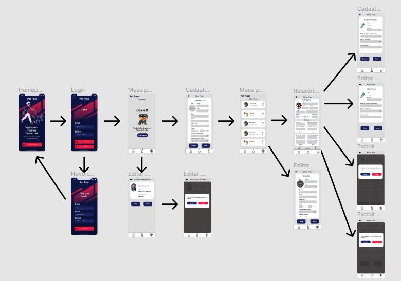

# Projeto de Interface

Pré-requisitos: <a href="2-Especificação do Projeto.md"> Documentação de Especificação</a>

Neste tópico é possível ter uma visão geral da interação do usuário pelas telas e funcionalidades que fazem parte do sistema (wireframes).

Dentre as diversas preocupações com a montagem da interface, foi estabelecido o foco em questões como: agilidade, acessibilidade e usabilidade da aplicação. Desta forma, o projeto tem uma identidade visual padronizada em todas as telas e foram projetadas para funcionamento em desktops.

## Diagrama de Fluxo

O diagrama de fluxo é um diagrama que representa um processo de interação entre o usuário e o sistema. Ele mostra o passo a passo de ações a serem realizadas pelo usuário para se chegar a um resultado na aplicação interativa.

A seguir, tem-se o Diagrama de Fluxo contruído para a aplicação do Pet Pass.

## Wireframes

São protótipos usados em design de interface para sugerir a estrutura de um site web e seu relacionamentos entre suas páginas. Um wireframe web é uma ilustração semelhante do layout de elementos fundamentais na interface.
 
 A imagem abaixo mostra uma visão geral dos Wireframes da aplicação Pet Pass e seu fluxo de usuário (Versão WEB):
 

## Telas iniciais:
Homepage: Tela de apresentação, que também proporciona ao usuário o conhecimento inicial das funcionalidades e objetivos do projeto.

Telas de Login e Cadastro: Telas responsáveis pelo cadstro e pela autenticação dos clientes que utilizam o sistema. 
 

## Telas internas:
Dão uma visão geral da aplicação, após autenticação do usuário. Na imagem abaixo são mostradas três telas: Tela de Pets cadastrados; Tela para cadastro de um ou mais Pets; Tela com maiores detalhes do Pet.

 Tela para cadastro de vacinas:

 
 Tela com informações do usuário:
 
 

 Tela de Notícias: 
   
   A princípio, o botão de notícias redirecionará à um site atualizado com as últimas notícias sobre Pets:
   
   https://gauchazh.clicrbs.com.br/ultimas-noticias/tag/animais/
   
 ## Protótipo versão Mobile
 
 A imagem abaixo mostra uma visão geral dos Wireframes mobile da aplicação Pet Pass e seu fluxo de usuário:
 
 
 
 ## Telas iniciais:
Homepage: Tela de apresentação, que também proporciona ao usuário o conhecimento inicial das funcionalidades e objetivos do projeto.

Telas de Login e Cadastro: Telas responsáveis pelo cadstro e pela autenticação dos clientes que utilizam o sistema. 

## Telas internas:
Dão uma visão geral da aplicação, após autenticação do usuário. Na imagem abaixo são mostradas três telas: Tela de Pets cadastrados; Tela para cadastro de um ou mais Pets; Tela com maiores detalhes do Pet.

 Tela para cadastro de vacinas:
 
 

 Tela com informações das vacinas:
 
 
 
 Tela de Notícias: 
   
 

