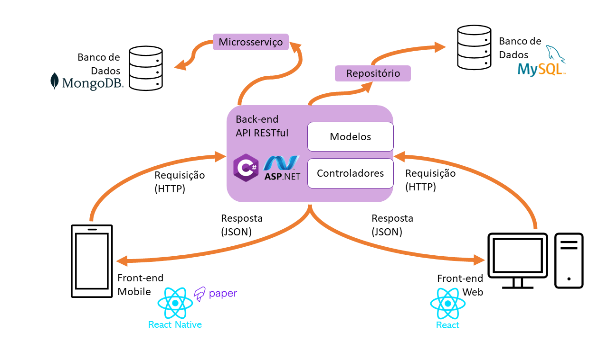

# Arquitetura da Solução

Pré-requisitos: <a href="3-Projeto de Interface.md"> Projeto de Interface</a>

A aplicação Pet Pass prevê a disponibilização, para os usuários, de duas interfaces distintas: um front-end mobile e um front-end web. 

Foi definida a utilização de um banco de dados relacional, de forma a garantir a consistência dos dados. Considerando, ainda, a natureza distribuída da aplicação, será utilizado o estilo arquitetural REST (REpresentational State Transfer), com o desenvolvimento de uma API RESTful.

Uma API RESTful deve seguir alguns princípios, como (IBM, 2022):
- **Interface uniforme**: requisiões para um mesmo recurso devem ser similares, independentemente da fonte da requisição.
- **Arquitetura cliente-servidor**: as aplicações para cliente e servidor devem ser totalmente independentes uma da outra.
- **Sem estado (statelessness)**: A requição deve incluir toda a informação necessária para processamento pelo servidor.
- **Cache**: Recursos podem ser mantidos em cache tanto no cliente como no servidor. Quando um cliente recebe uma resposta de um servidor,
- **Sistema em camadas**: requisições e respostas podem passar por diversas camadas.
- **Código sob demanda (opcional)**: Código executável pode ser retornado nas respostas de um serviço.

Uma API RESTful utiliza os verbos HTTP para realizar operações de CRUD (inserção, consulta, atualização e exclusão):

| CRUD | HTTP |
| ---- | ---- |
| Create | POST |
| Read | GET |
| Update | PUT,PATCH |
| Delete | DELETE |

Por fim, a API será composta de duas camadas: modelo e controlador.

## Tecnologias utilizadas: ##

A aplicação será desenvolvida utilizando as seguintes tecnologias:
- Back-end: CSharp
- Front-end móvel: React-Native
- Front-end Web: React
- Banco de Dados: 
    - Dados de usuários, pets e vacinas: MySQL
    - Notícias: MongoDB

## Refatoração

Com a necessidade de se introduzir no projeto o teste de unidade, descobriu-se que a arquitetura utilizada é inadequada para tal (ver <a href="8-Plano de Testes de Software.md"> Plano de Testes de Software</a>).

Assim, tornou-se necessária a refatoração do código para o padrão de projeto Repositório, incluindo uma camada entre o bando de dados e o modelo de negócios.

O novo esquema pode ser visto abaixo:

## Diagrama de Classes

O diagrama de classes ilustra graficamente como será a estrutura do software, e como cada uma das classes da sua estrutura estarão interligadas. Essas classes servem de modelo para materializar os objetos que executarão na memória.

As referências abaixo irão auxiliá-lo na geração do artefato “Diagrama de Classes”.

> - [Diagramas de Classes - Documentação da IBM](https://www.ibm.com/docs/pt-br/rational-soft-arch/9.6.1?topic=diagrams-class)
> - [O que é um diagrama de classe UML? | Lucidchart](https://www.lucidchart.com/pages/pt/o-que-e-diagrama-de-classe-uml)

## Modelo ER

O Esquema Relacional corresponde à representação dos dados em tabelas juntamente com as restrições de integridade e chave primária.

## Modelo Físico

Entregar um arquivo banco.sql contendo os scripts de criação das tabelas do banco de dados. Este arquivo deverá ser incluído dentro da pasta src\bd.

## Tecnologias Utilizadas

Para a elaboração da página web serão utilizadas as seguintes linguagens:
- Front-end: React Js, Bootstrap e Visual Studio.
- Back-end: C# - ASP.NET Core, Insomnia

Como ferramentas de diagramação serão utilizados:
- Figma (https://www.figma.com/)
- Lucidchart (https://www.lucidchart.com/pages/pt)
- Astah UML (https://astah.net/downloads/)
- ProjectLibre (https://www.projectlibre.com/)

Como ferramentas de suporte ao design serão utilizados os seguintes sites:
- Freepik (https://br.freepik.com/)
- Flatcon (https://www.flaticon.com/br/)

Como ferramenta de registro dos testes de usabilidade será utilizado:
- UnitX e Moq

## Hospedagem

Explique como a hospedagem e o lançamento da plataforma foi feita.

> **Links Úteis**:
>
> - [Website com GitHub Pages](https://pages.github.com/)
> - [Programação colaborativa com Repl.it](https://repl.it/)
> - [Getting Started with Heroku](https://devcenter.heroku.com/start)
> - [Publicando Seu Site No Heroku](http://pythonclub.com.br/publicando-seu-hello-world-no-heroku.html)

## Qualidade de Software

Conceituar qualidade de fato é uma tarefa complexa, mas ela pode ser vista como um método gerencial que através de procedimentos disseminados por toda a organização, busca garantir um produto final que satisfaça às expectativas dos stakeholders.

No contexto de desenvolvimento de software, qualidade pode ser entendida como um conjunto de características a serem satisfeitas, de modo que o produto de software atenda às necessidades de seus usuários. Entretanto, tal nível de satisfação nem sempre é alcançado de forma espontânea, devendo ser continuamente construído. Assim, a qualidade do produto depende fortemente do seu respectivo processo de desenvolvimento.

A norma internacional ISO/IEC 25010, que é uma atualização da ISO/IEC 9126, define oito características e 30 subcaracterísticas de qualidade para produtos de software. 

Com base nessas características e subcaracterísticas segue abaixo as que foram escolhidas para nortear o desenvolvimento projeto do Pet Pass mobile, bem como a justificativa e métricas que permitirão à equipe avaliar os objetos de interesse. 

**Segurança**:

- Confidencialidade: *A aplicação garante a confidencialidade dos dados? Sim e Não.*

- Integridade: *A aplicação garante a integridade dos dados? Sim e Não.*

**Usabilidade**:

- Apreensibilidade: *É fácil aprender a utilizar a aplicação? Sim e Não.*

- Operacionalidade: *É fácil de operar e controlar a funcionalidades da aplicação? Sim e Não.*

- Estética da interface: *A aplicação possui interface atual? Sim e Não.*

- Inteligibilidade: *A interface é de fácil entendimento? Sim e Não*

**Portabilidade** :

- Adaptabilidade: *O sistema esta adaptado a Android e IOS? Sim e Não.*

- Facilidade de para ser instalado: *É fácil instalar a aplicação em outros ambientes? Sim e Não.*

- Conformidade: *O sistema apresenta aderência a padrões de portabilidade? Sim e Não*

**Confiabilidade** :

- Maturidade: *Com que frequência a aplicação apresenta falhas? Sempre, As vezes e Nunca.*

- Recuperabilidade: *A aplicação é capaz de recuperar dados após uma falha? Sim e Não.*

- Tolerância a falhas: *A aplicação reage bem às falhas que aparecem? Sim e Não*

**Eficiência** :

- Tempo: *Mínimo tempo de resposta? Sim e Não. Máxima velocidade de execução? Sim e Não*

- Recursos utilizados: *Mínimo uso de recursos para o mesmo resultado? Sim e Não*

**Manutenibilidade** :

- Modificabilidade: *Há facilidade em modificar o código? Sim e Não*

- Testabilidade: *Há facilidade de testar a aplicação? Sim e Não*
