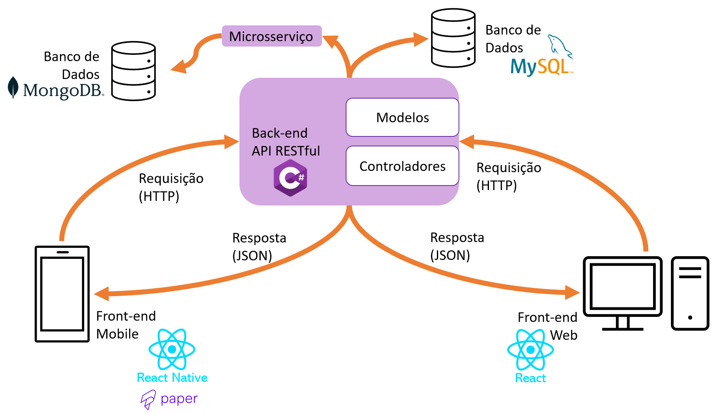

# Arquitetura da Solução

Pré-requisitos: <a href="3-Projeto de Interface.md"> Projeto de Interface</a>

A aplicação Pet Pass prevê a disponibilização, para os usuários, de duas interfaces distintas: um front-end mobile e um front-end web. 

Foi definida a utilização de um banco de dados relacional, de forma a garantir a consistência dos dados. Considerando, ainda, a natureza distribuída da aplicação, será utilizado o estilo arquitetural REST (REpresentational State Transfer), com o desenvolvimento de uma API RESTful.

Uma API RESTful deve seguir alguns princípios, como (IBM, 2022):
- **Interface uniforme**: requisiões para um mesmo recurso devem ser similares, independentemente da fonte da requisição.
- **Arquitetura cliente-servidor**: as aplicações para cliente e servidor devem ser totalmente independentes uma da outra.
- **Sem estado (statelessness)**: A requição deve incluir toda a informação necessária para processamento pelo servidor.
- **Cache**: Recursos podem ser mantidos em cache tanto no cliente como no servidor. Quando um cliente recebe uma resposta de um servidor,
- **Sistema em camadas**: requisições e respostas podem passar por diversas camadas.
- **Código sob demanda (opcional)**: Código executável pode ser retornado nas respostas de um serviço.

Uma API RESTful utiliza os verbos HTTP para realizar operações de CRUD (inserção, consulta, atualização e exclusão):

| CRUD | HTTP |
| ---- | ---- |
| Create | POST |
| Read | GET |
| Update | PUT,PATCH |
| Delete | DELETE |

Por fim, a API será composta de duas camadas: modelo e controlador.

## Tecnologias utilizadas: ##

A aplicação será desenvolvida utilizando as seguintes tecnologias:
- Back-end: CSharp
- Front-end móvel: React-Native
- Front-end Web: React
- Banco de Dados: 
    - Dados de usuários, pets e vacinas: MySQL
    - Notícias: MongoDB

## Diagrama de Classes

O diagrama de classes ilustra graficamente como será a estrutura do software, e como cada uma das classes da sua estrutura estarão interligadas. Essas classes servem de modelo para materializar os objetos que executarão na memória.

As referências abaixo irão auxiliá-lo na geração do artefato “Diagrama de Classes”.

> - [Diagramas de Classes - Documentação da IBM](https://www.ibm.com/docs/pt-br/rational-soft-arch/9.6.1?topic=diagrams-class)
> - [O que é um diagrama de classe UML? | Lucidchart](https://www.lucidchart.com/pages/pt/o-que-e-diagrama-de-classe-uml)

## Modelo ER

## Esquema Relacional

O Esquema Relacional corresponde à representação dos dados em tabelas juntamente com as restrições de integridade e chave primária.
 
As referências abaixo irão auxiliá-lo na geração do artefato “Esquema Relacional”.

> - [Criando um modelo relacional - Documentação da IBM](https://www.ibm.com/docs/pt-br/cognos-analytics/10.2.2?topic=designer-creating-relational-model)

## Modelo Físico

Entregar um arquivo banco.sql contendo os scripts de criação das tabelas do banco de dados. Este arquivo deverá ser incluído dentro da pasta src\bd.

## Tecnologias Utilizadas

Descreva aqui qual(is) tecnologias você vai usar para resolver o seu problema, ou seja, implementar a sua solução. Liste todas as tecnologias envolvidas, linguagens a serem utilizadas, serviços web, frameworks, bibliotecas, IDEs de desenvolvimento, e ferramentas.

Apresente também uma figura explicando como as tecnologias estão relacionadas ou como uma interação do usuário com o sistema vai ser conduzida, por onde ela passa até retornar uma resposta ao usuário.

## Hospedagem

Explique como a hospedagem e o lançamento da plataforma foi feita.

> **Links Úteis**:
>
> - [Website com GitHub Pages](https://pages.github.com/)
> - [Programação colaborativa com Repl.it](https://repl.it/)
> - [Getting Started with Heroku](https://devcenter.heroku.com/start)
> - [Publicando Seu Site No Heroku](http://pythonclub.com.br/publicando-seu-hello-world-no-heroku.html)

## Qualidade de Software

Conceituar qualidade de fato é uma tarefa complexa, mas ela pode ser vista como um método gerencial que através de procedimentos disseminados por toda a organização, busca garantir um produto final que satisfaça às expectativas dos stakeholders.

No contexto de desenvolvimento de software, qualidade pode ser entendida como um conjunto de características a serem satisfeitas, de modo que o produto de software atenda às necessidades de seus usuários. Entretanto, tal nível de satisfação nem sempre é alcançado de forma espontânea, devendo ser continuamente construído. Assim, a qualidade do produto depende fortemente do seu respectivo processo de desenvolvimento.

A norma internacional ISO/IEC 25010, que é uma atualização da ISO/IEC 9126, define oito características e 30 subcaracterísticas de qualidade para produtos de software.
Com base nessas características e nas respectivas sub-características, identifique as sub-características que sua equipe utilizará como base para nortear o desenvolvimento do projeto de software considerando-se alguns aspectos simples de qualidade. Justifique as subcaracterísticas escolhidas pelo time e elenque as métricas que permitirão a equipe avaliar os objetos de interesse.

> **Links Úteis**:
>
> - [ISO/IEC 25010:2011 - Systems and software engineering — Systems and software Quality Requirements and Evaluation (SQuaRE) — System and software quality models](https://www.iso.org/standard/35733.html/)
> - [Análise sobre a ISO 9126 – NBR 13596](https://www.tiespecialistas.com.br/analise-sobre-iso-9126-nbr-13596/)
> - [Qualidade de Software - Engenharia de Software 29](https://www.devmedia.com.br/qualidade-de-software-engenharia-de-software-29/18209/)
