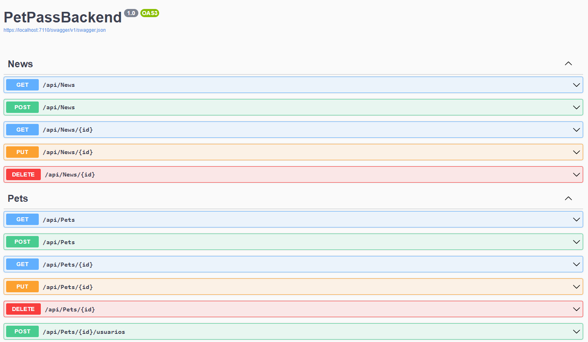
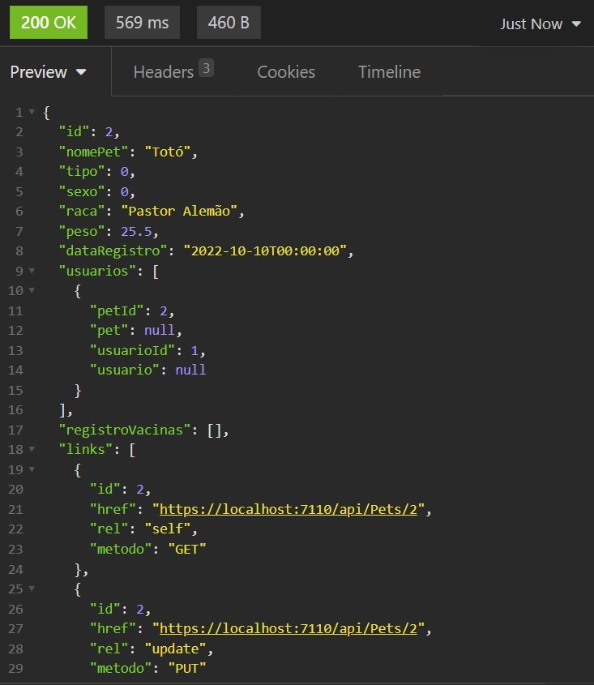

# Programação de Funcionalidades

## API
Foi desenvolvida a API REST em ASP.NET, banco de dasos MySQL para os modelos relacionais e MongoDB para notícias.
Documentação em OpenAPI com swagger.

**Nível de maturidade de Richardson: Nível 3** - Controles hipermídia - API navegável pelo uso de HATEOAS (Hypertext As The Engine Of Application State).

## Refatoração

Conforme detalhado em <a href="8-Plano de Testes de Software.md"> Plano de Testes de Software</a>, toda a API precisou ser refatorada para o padrão de projeto Repositório.

A refatoração incluiu:
- Criação da camada (diretório) Repositório, onde foram colocadas interfaces de Repositório para cada Entidade