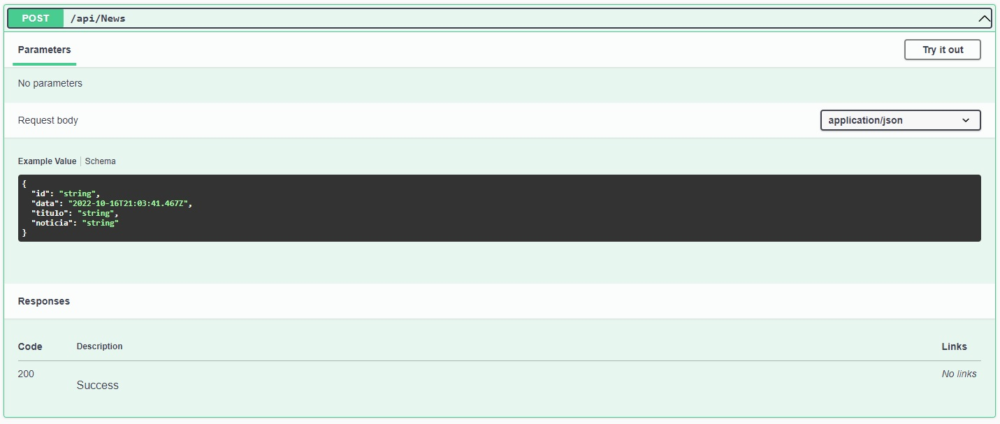

# Programação de Funcionalidades

## API
Foi desenvolvida a API REST em ASP.NET, banco de dasos MySQL para os modelos relacionais e MongoDB para notícias.
Documentação em OpenAPI com swagger.

**Nível de maturidade de Richardson: Nível 3** - Controles hipermídia - API navegável pelo uso de HATEOAS (Hypertext As The Engine Of Application State).

