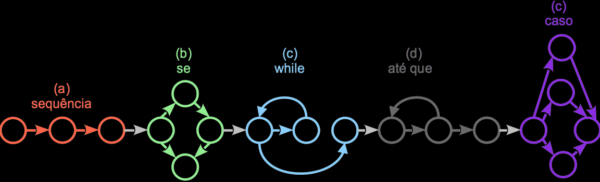
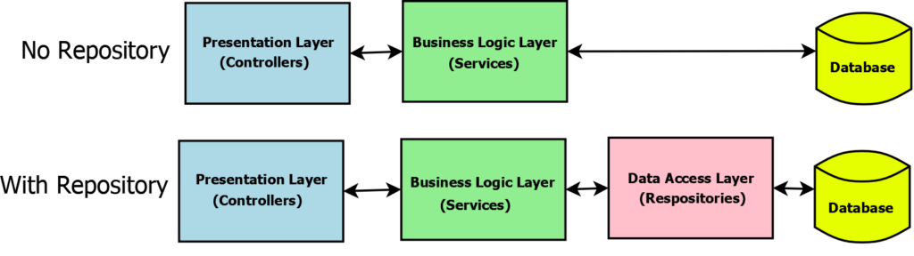

# Plano de Testes de Software

O primeiro passo para a elaboração de uma plano de teste de Software é a definição da quantidade de testes de maneira sistematizada. Pode-se adotar a abordagem do Teste da caixa branca ou do Teste da Caixa Preta (GOMES, 2022).
O teste da caixa preta não envolve a análise do código, sendo usado para testes de interface.
O teste da caixa branca se baseia em um exame rigoroso do código para certificar que todos os caminhos independentes sejam testados pelo menos uma vez. Podem ser usadas diversas técnicas, como o Teste do caminho básico, para então, produzir um Grafo de Fluxo de Controle (GFC), cuja notação pode ser vista na figura a seguir (PRESSMAN, 2016):

Considerando que os métodos a serem testados no PetPass, que são os métodos CRUD dos controladores, a elaboração dos GFCs para cada método, a princípio, será de apenas um nó, já que todos os métodos são simples.

Por esta razão, não será elaborado o GFC.

## Testabilidade
O foco do plano de testes do PetPass serão os testes de unidade. São testes automatizados que têm o objetivo de verificar as menores partes de um código - em geral, métodos.
Entretanto, a elaboração de um teste de unidade exige que o código seja *testável*. Segundo SCOTT (2010), uma equipe de desenvolvimento deve investir algum esforço para criar e manter os testes de unidade, e a quantidade de esforço é relacionada à "testabilidade" do código.

SCOTT (2010) cita, ainda, as qualidade de um código testável: o código deve ser fácil de ler e deve ser fácil de *isolar*. O isolamento é referente, principalmente, às dependências, como uma conexão com banco de dados ou um serviço de SMTP. Criar um teste unitário em que o método de fato, faz a conexão com o bando de dados, cria alguns problemas, como: o teste pode falhar devido a um problema de conexão

Assim, a arquitetura escolhida para a construção do PetPass se mostrou não testável, uma vez que o contexto (que faz a conexão com o BD) é injetado diretamente dentro dos controladores.
Para viabilizar os testes unitários dos controladores, portanto, será necessário refatorar a API, segundo um padrão de projeto que permita o isolamento das dependências.

O padrão de projeto escolhido é o padrão Repositório.

## O Padrão de Projeto Repositório

O *repository pattern* resumidamente, inclui uma camada que faz a mediação entre o modelo de negócio e o banco de dados, como pode ser visto no esquema abaixo, de SANJAY (2021).

O isolamento da camada de conexão com o Banco de Dados proporciona o isolamento deste, tornando o código testável.

Uma vez refatorado o código, é possível testar, isoladamente, cada um dos métodos CRUD. Entretanto, como cada método faz uma consulta e/ou alteração no Banco de Dados, é necessário introduzir a simulação de objetos, ou "Mocking".

## Mocking

A definição de *mocking*, segundo o dicionário Cambridge, é "não real, mas parecendo ou fingindo ser exatamente como algo" (not real but appearing or pretending to be exactly like something).
No âmbito do desenvolvimento de software, *mocking* é a simulação do comportamento de objetos complexos, de forma controlada, usada principalmente em testes unitários.

## Ferramentas de Testes

Serão usadas as seguintes ferramentas para o desenvolvimento e execução dos testes unitários:
- UnitX - framework para desenvolvimento e execução dos testes
- Moq - framework para simulação do contexto (conexão com o bando de dados)

# O Plano de Testes

Os testes unitários serão desenvolvidos para todos os métodos CRUD de todos os controladores:
- PetsController
    - GetAll
    - GetById
    - Create
    - Update
    - Delete
- UsuariosController
    - GetAll
    - GetById
    - Create
    - Update
    - Delete
- VacinasController
    - GetAll
    - GetById
    - Create
    - Update
    - Delete
- NewsController
    - GetAll
    - GetById
    - Create
    - Update
    - Delete    