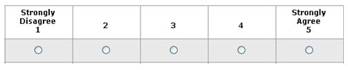

# Registro de Testes de Usabilidade

Após aplicação dos testes de usabilidade, obtém-se um relatório a partir das análises realizadas. O Registro de Testes de Usabilidade é um relatório que contém as evidências dos testes e relatos dos usuários participantes, baseado no Plano de Testes de Usabilidade desenvolvido para os casos de uso desta etapa.

O método utilizado para o Teste de Usabilidade da aplicação PetPass Mobile foi o Método SUS (System Usability Scale), que contempla um questionário de 10 perguntas a cerca da usabilidade da aplicação. Para cada uma das perguntas, o usuário pode responder utilizando uma escala de 1 a 5, na qual 1 significa "Discordo Completamente" e 5 significa "Concordo Completamente".

Abaixo é possivel visualizar o resultado geral de cada usuário apos a utilização das aplicações WEB e do Mobile do Pet Pass. 

### **Usuário 1:**

### **Marcos, 18 anos, possui 1 gato**

| **Perguntas**                                                                              | **Respostas**   | **Conversão**    |
| ------------------------------------------------------------------------------------------ | --------------- | ---------------- |
| 1 - Eu acho que a interface do sistema permite a visualização adequada das funcionalidades |        4        |     4-1=3        |
| 2 - Eu acho que o sistema é complexo                                                       |        1        |     5-1=4        |
| 3 - Eu acho que as telas do sistema são padronizadas e de fácil compreensão                |        4        |     4-1=3        |
| 4 - Eu acho que o sistema não se mostrou prático, rápido, intuitivo e de fácil utilização  |        1        |     5-1=4        |
| 5 - Eu acho que a interface apresenta uma aparência agradável e minimalista                |        4        |     4-1=3        |
| 6 - Eu não localizei informações sobre como utilizar a aplicação                           |        5        |     5-5=0        |
| 7 - Eu acho que o sistema funcionou adequadamente durante todo o uso                       |        4        |     4-1=3        |
| 8 - Eu acho que a aplicação não se mostrou acessível para pessoas com deficiência          |        5        |     5-5=0        |
| 9 - Eu acho que estou satisfeita com esta aplicação                                        |        4        |     4-1=3        |
| 10 - Eu não indicaria esta aplicação para outras pessoas                                   |        1        |     5-1=4        |
|                                                                                            | **Cálculo SUS** | **27*2,5=67,50** |

---

### **Usuário 2:**

### **Diane, 35 anos, possui 1 gato e 1 cachorro**

| **Perguntas**                                                                              | **Respostas**   | **Conversão**    |
| ------------------------------------------------------------------------------------------ | --------------- | ---------------- |
| 1 - Eu acho que a interface do sistema permite a visualização adequada das funcionalidades |        5        |     5-1=4        |
| 2 - Eu acho que o sistema é complexo                                                       |        1        |     5-1=4        |
| 3 - Eu acho que as telas do sistema são padronizadas e de fácil compreensão                |        5        |     5-1=4        |
| 4 - Eu acho que o sistema não se mostrou prático, rápido, intuitivo e de fácil utilização  |        1        |     5-1=4        |
| 5 - Eu acho que a interface apresenta uma aparência agradável e minimalista                |        4        |     4-1=3        |
| 6 - Eu não localizei informações sobre como utilizar a aplicação                           |        5        |     5-5=0        |
| 7 - Eu acho que o sistema funcionou adequadamente durante todo o uso                       |        4        |     4-1=3        |
| 8 - Eu acho que a aplicação não se mostrou acessível para pessoas com deficiência          |        5        |     5-5=0        |
| 9 - Eu acho que estou satisfeita com esta aplicação                                        |        4        |     4-1=3        |
| 10 - Eu não indicaria esta aplicação para outras pessoas                                   |        1        |     5-1=4        |
|                                                                                            | **Cálculo SUS** |**29*2,5=72,50**  |

---

### **Usuário 3:**

### **Douglas, 43 anos, possui 1 gato**

| **Perguntas**                                                                              | **Respostas**   | **Conversão**    |
| ------------------------------------------------------------------------------------------ | --------------- | ---------------- |
| 1 - Eu acho que a interface do sistema permite a visualização adequada das funcionalidades |        5        |     5-1=4        |
| 2 - Eu acho que o sistema é complexo                                                       |        1        |     5-1=4        |
| 3 - Eu acho que as telas do sistema são padronizadas e de fácil compreensão                |        5        |     5-1=4        |
| 4 - Eu acho que o sistema não se mostrou prático, rápido, intuitivo e de fácil utilização  |        2        |     5-2=3        |
| 5 - Eu acho que a interface apresenta uma aparência agradável e minimalista                |        4        |     4-1=3        |
| 6 - Eu não localizei informações sobre como utilizar a aplicação                           |        5        |     5-5=0        |
| 7 - Eu acho que o sistema funcionou adequadamente durante todo o uso                       |        4        |     4-1=3        |
| 8 - Eu acho que a aplicação não se mostrou acessível para pessoas com deficiência          |        5        |     5-5=0        |
| 9 - Eu acho que estou satisfeita com esta aplicação                                        |        4        |     4-1=3        |
| 10 - Eu não indicaria esta aplicação para outras pessoas                                   |        2        |     5-2=3        |
|                                                                                            | **Cálculo SUS** |**27*2,5=67,50**  |

---

### **Usuário 4:**

### **Vicente, 67 anos de idade, possui 1 gato e 2 cachorros**

| **Perguntas**                                                                              | **Respostas**   | **Conversão**    |
| ------------------------------------------------------------------------------------------ | --------------- | ---------------- |
| 1 - Eu acho que a interface do sistema permite a visualização adequada das funcionalidades |        4        |     4-1=3        |
| 2 - Eu acho que o sistema é complexo                                                       |        1        |     5-1=4        |
| 3 - Eu acho que as telas do sistema são padronizadas e de fácil compreensão                |        4        |     4-1=3        |
| 4 - Eu acho que o sistema não se mostrou prático, rápido, intuitivo e de fácil utilização  |        2        |     5-2=3        |
| 5 - Eu acho que a interface apresenta uma aparência agradável e minimalista                |        5        |     5-1=4        |
| 6 - Eu não localizei informações sobre como utilizar a aplicação                           |        3        |     5-3=2        |
| 7 - Eu acho que o sistema funcionou adequadamente durante todo o uso                       |        3        |     3-1=2        |
| 8 - Eu acho que a aplicação não se mostrou acessível para pessoas com deficiência          |        3        |     5-3=2        |
| 9 - Eu acho que estou satisfeita com esta aplicação                                        |        4        |     4-1=3        |
| 10 - Eu não indicaria esta aplicação para outras pessoas                                   |        2        |     5-2=3        |
|                                                                                            | **Cálculo SUS** |**29*2,5=72,50**  |

---

### **Usuário 5:**

### **Jade, 28 anos, possui 3 cachorros**

| **Perguntas**                                                                              | **Respostas**   | **Conversão**    |
| ------------------------------------------------------------------------------------------ | --------------- | ---------------- |
| 1 - Eu acho que a interface do sistema permite a visualização adequada das funcionalidades |        4        |     4-1=3        |
| 2 - Eu acho que o sistema é complexo                                                       |        1        |     5-1=4        |
| 3 - Eu acho que as telas do sistema são padronizadas e de fácil compreensão                |        4        |     4-1=3        |
| 4 - Eu acho que o sistema não se mostrou prático, rápido, intuitivo e de fácil utilização  |        2        |     5-2=3        |
| 5 - Eu acho que a interface apresenta uma aparência agradável e minimalista                |        3        |     3-1=2        |
| 6 - Eu não localizei informações sobre como utilizar a aplicação                           |        4        |     5-4=1        |
| 7 - Eu acho que o sistema funcionou adequadamente durante todo o uso                       |        3        |     3-1=2        |
| 8 - Eu acho que a aplicação não se mostrou acessível para pessoas com deficiência          |        4        |     5-4=1        |
| 9 - Eu acho que estou satisfeita com esta aplicação                                        |        4        |     4-1=3        |
| 10 - Eu não indicaria esta aplicação para outras pessoas                                   |        1        |     5-1=4        |
|                                                                                            | **Cálculo SUS** |**26*2,5=65,00**  |

---

### **Usuário 6:**

### **Fernando, 43 anos, possui 1 gato e um cachorro**

| **Perguntas**                                                                              | **Respostas**   | **Conversão**    |
| ------------------------------------------------------------------------------------------ | --------------- | ---------------- |
| 1 - Eu acho que a interface do sistema permite a visualização adequada das funcionalidades |        5        |     5-1=4        |
| 2 - Eu acho que o sistema é complexo                                                       |        1        |     5-1=4        |
| 3 - Eu acho que as telas do sistema são padronizadas e de fácil compreensão                |        4        |     4-1=3        |
| 4 - Eu acho que o sistema não se mostrou prático, rápido, intuitivo e de fácil utilização  |        2        |     5-2=3        |
| 5 - Eu acho que a interface apresenta uma aparência agradável e minimalista                |        4        |     4-1=3        |
| 6 - Eu não localizei informações sobre como utilizar a aplicação                           |        3        |     5-3=2        |
| 7 - Eu acho que o sistema funcionou adequadamente durante todo o uso                       |        4        |     4-1=3        |
| 8 - Eu acho que a aplicação não se mostrou acessível para pessoas com deficiência          |        4        |     5-4=1        |
| 9 - Eu acho que estou satisfeita com esta aplicação                                        |        4        |     4-1=3        |
| 10 - Eu não indicaria esta aplicação para outras pessoas                                   |        2        |     5-2=3        |
|                                                                                            | **Cálculo SUS** |**29*2,5=72,50**  |

---

## Análise dos resultados:

Por meio das 10 perguntas feitas a cada usuário, foram obtidos valores de 1 a 5 transformados em pontos, de acordo com a metodologia SUS.
Após essa quantificação, o valor médio obtido na rodada de testes foi de **69,58** pontos.

## Conclusão:

De acordo com a Metodologia SUS o valor de referência para análise dos testes é de 68 pontos. Como o resultado médio obtido após a realização dos testes está pouco acima desse valor conclui-se que a aplicação esteja adequada aos parâmetros requeridos para uma boa aceitação de layout e funcionalidades. Entende-se também que existe grande espaço para a aplicação de melhorias e elevação da nota do SUS.
